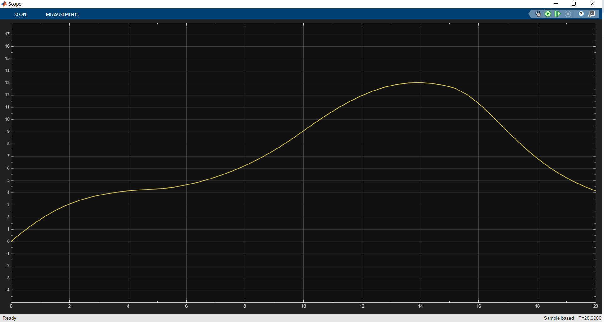
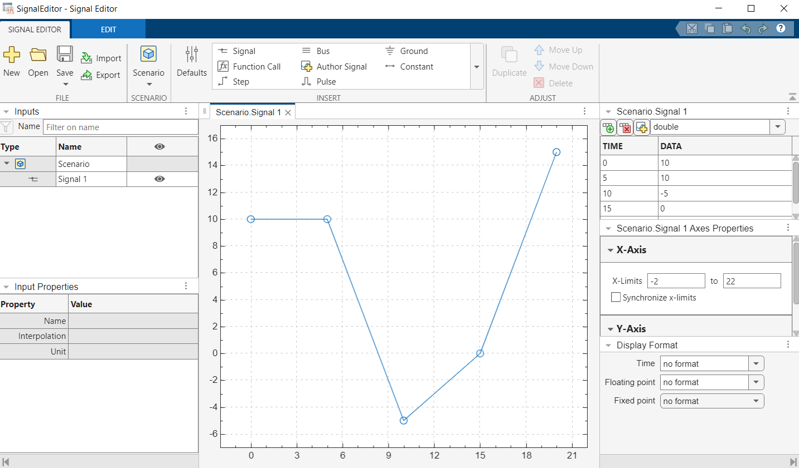

# IDM Model-in-the-Loop (MIL) Test Project | IDM Model-in-the-Loop (MIL) Test Projesi

[🇬🇧 English](#english) | [🇹🇷 Türkçe](#turkce)

---

## English

### 🚗 Project Description
This project contains the **Model-in-the-Loop (MIL)** testing implementation of the **Intelligent Driver Model (IDM)** algorithm in MATLAB/Simulink environment. Vehicle following behaviors are tested under different traffic scenarios.

### 📋 File Structure
IDM_MIL_Test/
├── IDM_Acceleration_Model_V2.slx    # Main Simulink model
├── SignalEditor.mat                 # Dynamic test scenarios
├── Images/                          # Project screenshots
│   ├── simulation_result.png        # Simulation results
│   ├── signal_editor_scenario.png   # Signal Editor scenario
│   └── model_overview.png           # Model overview
└── README.md                       # Project documentation

### 📊 Simulation Results

### 🎛️ Signal Editor Scenario

### 🎯 Features
- ✅ **Complete IDM Formula**: Full implementation of original IDM algorithm
- ✅ **Dynamic Test Scenarios**: Variable traffic conditions with Signal Editor
- ✅ **Feedback Control**: Real-time velocity feedback
- ✅ **MIL Validation**: Model behavior analysis under different scenarios

### ⚠️ MATLAB Version Warning
**Signal Builder Deprecated**: MATLAB's legacy Signal Builder block is no longer supported. This project uses **Signal Editor** (recommended alternative by MATLAB).

### 🔧 System Requirements
- MATLAB
- Simulink
- Control System Toolbox (optional)

### 🔧 Used Simulink Blocks
- **Signal Editor** - Dynamic scenario generation
- **MATLAB Function** - IDM algorithm implementation
- **Integrator** - Acceleration to velocity conversion
- **Scope** - Result visualization
- **Constant** - Distance parameter input
- **Feedback Connection** - Closed-loop velocity control

### 🚀 Usage Steps
1. Open MATLAB
2. Add project folder to MATLAB path
3. Open `IDM_Acceleration_Model_V2.slx`
4. Press **Run** button to start simulation
5. Observe results in Vehicle_Speed scope

### 📊 Test Scenarios
Dynamic Delta_V profile defined with Signal Editor:
- **0-5s**: ΔV = 10 m/s (acceleration phase)
- **5-10s**: ΔV = -5 m/s (deceleration phase)
- **10-15s**: ΔV = 0 m/s (constant speed phase)
- **15-20s**: ΔV = 15 m/s (strong acceleration phase)

### ⚙️ IDM Parameters
| Parameter | Value | Description |
|-----------|-------|-------------|
| a | 2 m/s² | Maximum acceleration |
| b | -2 m/s² | Minimum deceleration |
| v₀ | 30 m/s | Cruise speed |
| s₀ | 2 m | Jam distance |
| T | 1.5 s | Time gap |
| δ | 2 | Aggressivity coefficient |

### 🔬 Test Results
- ✅ Model works mathematically correct
- ✅ Provides realistic responses to dynamic scenarios
- ✅ Feedback system operates stably
- ✅ MIL test criteria are met

### 📈 Next Steps
- SIL (Software-in-the-Loop) testing
- HIL (Hardware-in-the-Loop) testing
- Real vehicle implementation

---

## Turkce

### 🚗 Proje Açıklaması
Bu proje, **Intelligent Driver Model (IDM)** algoritmasının MATLAB/Simulink ortamında **MIL (Model-in-the-Loop)** test implementasyonunu içermektedir. Araç takip davranışları farklı trafik senaryolarında test edilmiştir.

### 📋 Dosya Yapısı
IDM_MIL_Test/
├── IDM_Acceleration_Model_V2.slx    # Ana Simulink modeli
├── SignalEditor.mat                 # Dinamik test senaryoları
├── Images/                          # Proje görselleri
│   ├── simulation_result.png        # Simülasyon sonuçları
│   ├── signal_editor_scenario.png   # Signal Editor senaryosu
│   └── model_overview.png           # Model genel görünümü
└── README.md                       # Proje dokümantasyonu

### 📊 Simülasyon Sonuçları

### 🎛️ Signal Editor Senaryosu

### 🎯 Özellikler
- ✅ **Tam IDM Formülü**: Orijinal IDM algoritmasının eksiksiz implementasyonu
- ✅ **Dinamik Test Senaryoları**: Signal Editor ile değişken trafik durumları
- ✅ **Feedback Kontrol**: Gerçek zamanlı hız geri beslemesi
- ✅ **MIL Doğrulama**: Farklı senaryolarda model davranış analizi

### ⚠️ MATLAB Sürüm Uyarısı
**Signal Builder Kaldırılmış**: MATLAB'ın eski Signal Builder bloğu artık desteklenmiyor. Bu projede **Signal Editor** kullanılmıştır (MATLAB tarafından önerilen alternatif).

### 🔧 Sistem Gereksinimleri
- MATLAB
- Simulink
- Control System Toolbox (opsiyonel)

### 🔧 Kullanılan Simulink Blokları
- **Signal Editor** - Dinamik senaryo üretimi
- **MATLAB Function** - IDM algoritması implementasyonu
- **Integrator** - İvmeden hıza dönüşüm
- **Scope** - Sonuç görselleştirmesi
- **Constant** - Mesafe parametresi girişi
- **Feedback Connection** - Kapalı çevrim hız kontrolü

### 🚀 Kullanım Adımları
1. MATLAB'ı açın
2. Proje klasörünü MATLAB path'ine ekleyin
3. `IDM_Acceleration_Model_V2.slx` dosyasını açın
4. **Run** butonuna basarak simulasyonu başlatın
5. Vehicle_Speed scope'unda sonuçları gözlemleyin

### 📊 Test Senaryoları
Signal Editor ile tanımlanan dinamik Delta_V profili:
- **0-5s**: ΔV = 10 m/s (hızlanma fazı)
- **5-10s**: ΔV = -5 m/s (yavaşlama fazı)
- **10-15s**: ΔV = 0 m/s (sabit hız fazı)
- **15-20s**: ΔV = 15 m/s (güçlü hızlanma fazı)

### ⚙️ IDM Parametreleri
| Parametre | Değer | Açıklama |
|-----------|-------|----------|
| a | 2 m/s² | Maksimum ivme |
| b | -2 m/s² | Minimum yavaşlama |
| v₀ | 30 m/s | Cruise hızı |
| s₀ | 2 m | Jam mesafesi |
| T | 1.5 s | Time gap |
| δ | 2 | Agresiflik katsayısı |

### 🔬 Test Sonuçları
- ✅ Model matematiksel olarak doğru çalışmaktadır
- ✅ Dinamik senaryolara gerçekçi tepkiler vermektedir
- ✅ Feedback sistemi kararlı çalışmaktadır
- ✅ MIL test kriterleri karşılanmaktadır

### 📈 Sonraki Aşamalar
- SIL (Software-in-the-Loop) testi
- HIL (Hardware-in-the-Loop) testi
- Gerçek araç implementasyonu

---

## 👨‍💻 Developer | Geliştirici
**AhmedBekmezci**

## 📜 License | Lisans
MIT License